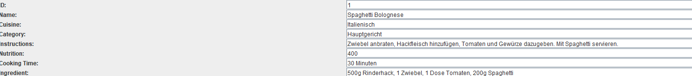
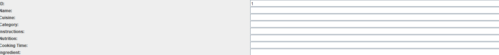
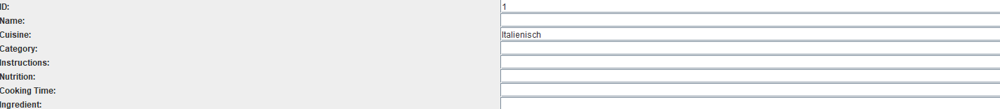

# **Recipe Management System**

## 📖 Introduction 

The recipe management system is a simple application for **storing and managing recipes**.

The recipes are stored in an **SQLite** database. 

## 💡 Why is the recipe management system useful?
It provides a simple and efficient way to manage recipes **digitally** and **centrally**, ensuring that all recipes are stored in one place and accessible at any time.

The clear and user-friendly interface allows users the:

- **Adding**

- **Deleting**

- **Editing**

- **Filtering recipes by criteria.**

## 🚀 Installation


### 📌 Requirements
- Java 23+ (Recommended OpenJDK 23)
- Apache Maven
- [H2 Database](https://www.h2database.com/) (Recommended 2.3.232)
- Mockito (Recommended 5.15.2)
- JUnit (Recommended 5.10.0)
- JDBC Treiber (Recommended 3.47.2.0)
- JOOQ (Recommended 3.19.17)

### 🛢️ Database Setup

The project uses **SQLite** as database. The database file is located in the repository at:

```plaintext
rezeptverwaltungsdb.db
```
### 📂 Clone and Start the project
- Clone the Repository
```sh
  git clone https://github.com/SirBooom/Prog3Projekt.git
```
- Install Dependencies
```sh
  cd Prog3Projekt
  mvn clean install
```
- Start the Application

  
```sh
   mvn exec:java -D"exec.mainClass"="Skeleton"
```


## 🍴📋 Usage

### ➕🍲 Adding a New Recipe

To add a new recipe, you can use the following form:

- **ID**: The recipe's ID
- **Name**: The name of the recipe
- **Cuisine**: The cuisine of the recipe
- **Category**: The category of the recipe
- **Instructions**: A step-by-step description of the preparation
- **Nutrition**: The nutritional values of the recipe
- **Cooking Time**: The preparation time
- **Ingredients**: The ingredients of the recipe

**Example**:

Enter the following information in the GUI:

- **ID**: 1
- **Name**: "Spaghetti Bolognese"
- **Cuisine**: "Italian"
- **Category**: "Main Course"
- **Instructions**: "Sauté onion, add ground beef, then add tomatoes and spices. Serve with spaghetti."
- **Nutrition**: 400 (in kcal)
- **Cooking Time**: "30 minutes"
- **Ingredients**: "500g ground beef, 1 onion, 1 can of tomatoes, 200g spaghetti"

**Screenshot of the form:**



---

### ❌🗑️ Delete a Recipe

To delete a recipe, enter the **ID** of the recipe in the form below and click on **"Delete Recipe"**.

**Example: The recipe with ID 1 will be deleted.**



---

### 🔄✏️ Update a Recipe

To update an existing recipe, enter the recipe's ID in the form, fill in the desired fields, and click on **"Update Recipe"**.

**Example: The cuisine of the recipe with ID 1 will be changed to "Italian."**



---

### 🔍📂 Filter a Recipe

To filter recipes, you can search by criteria such as Name, Cuisine, or Category. Simply fill in the desired field below in the form and click on **"Filter Recipes"**.

**Example: All recipes from the Italian cuisine will be filtered.**


---

### 📜📤 Load All Recipes

To view all recipes, click on **"Load Recipes"**. All saved recipes will be displayed in the list.

---

### 🗑️🧹 Delete All Recipes

To delete all recipes at once, click on **"Delete all Recipes"**. Please note that this action cannot be undone!

---

### 🚧🔨 Shop Function (Under Development)
The shop is currently under development. Please check back later for updates.

---

### 🛠️⚙️ Balance Function (Under Development)
The balance functionality is still in progress and will be available in a future release.

---

## 👥 Authors

This project is managed by the following team members:  

[@EmirKayaagil](https://github.com/EmirKayaagil) • [@SirBooom](https://github.com/SirBooom) • [@SmallYhorm](https://github.com/SmallYhorm)  


## 🔧 Contribute
**Community contributions are welcome**  
If you would like to help, follow these steps:

1. Fork the repository
2. Create a new branch (feature/new-feature)
3. Make your changes and commit them
4. Create a Pull Request (PR)


Do you have an idea or suggestions for improvement?

Create an issue with a brief description of your suggestion. Discuss it with the team or other contributors.

📢 We look forward to your help!

## ❓ Help & Support

If you encounter any issues or have questions, there are several ways to get support:

📜 README & Documentation: Check the README first to see if your question has already been answered.

🐞 GitHub Issues: If you find a bug, please create an issue.

🚀 We’re happy to assist!


